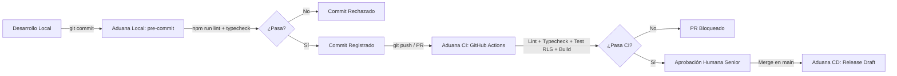

# ⚖️ LegalOS Monolith AI

> Plataforma tecnológica jurídica integral construida con arquitectura modular monolítica, filosofía **Zero-Trust** y aislamiento estricto multi-tenant respaldado por **Row Level Security (RLS)** en PostgreSQL.

---

## 📋 Tabla de Contenidos
1. [Visión General y Arquitectura](#-visión-general-y-arquitectura)
2. [Stack Tecnológico](#-stack-tecnológico)
3. [Estructura del Repositorio](#-estructura-del-repositorio)
4. [Aduanas de Calidad y Blindaje (Quality Gates)](#-aduanas-de-calidad-y-blindaje-quality-gates)
5. [Guía de Procedimientos Paso a Paso](#-guía-de-procedimientos-paso-a-paso)
   - [Paso 1: Inicialización de Node.js y Git](#paso-1-inicialización-de-nodejs-y-git)
   - [Paso 2: Instalación de Dependencias](#paso-2-instalación-de-dependencias)
   - [Paso 3: Tipado Estricto de TypeScript (`tsconfig.json`)](#paso-3-tipado-estricto-de-typescript-tsconfigjson)
   - [Paso 4: Configuración de Linter con ESLint 9 Flat Config (`eslint.config.js`)](#paso-4-configuración-de-linter-con-eslint-9-flat-config-eslintconfigjs)
   - [Paso 5: Gobernanza Git y Hook Local Pre-Commit](#paso-5-gobernanza-git-y-hook-local-pre-commit)
   - [Paso 6: Automatización CI/CD con GitHub Actions](#paso-6-automatización-cicd-con-github-actions)
   - [Paso 7: Suite Adversarial de Pruebas Multi-Tenant (RLS)](#paso-7-suite-adversarial-de-pruebas-multi-tenant-rls)
   - [Paso 8: Feature Flagging con Tipado Fuerte](#paso-8-feature-flagging-con-tipado-fuerte)
6. [Resolución de Problemas Conocidos](#-resolución-de-problemas-conocidos)
   - [Error de referencia circular en ESLint](#1-error-de-referencia-circular-en-eslint-al-hacer-commit)
   - [Commits bloqueados por firma GPG](#2-bloqueo-del-commit-en-segundo-plano-por-firma-gpg)
7. [Scripts Disponibles](#-scripts-disponibles)

---

## 🏛️ Visión General y Arquitectura

LegalOS Monolith AI unifica la gestión de expedientes judiciales, plazos procesales, almacenamiento documental cifrado y agentes de IA en una única base de código robusta. 

El sistema sigue una arquitectura orientada a la **Confianza Cero (Zero-Trust)**:
- **Seguridad en la Capa de Datos:** No se delega la seguridad exclusivamente a la capa de aplicación. Cada acceso a la base de datos es filtrado a nivel de fila por PostgreSQL mediante políticas de **Row Level Security (RLS)** vinculadas al `firm_id` (identificador de la firma o despacho).
- **TypeScript Estricto:** Prohibición absoluta de tipos `any`, indexación insegura (`noUncheckedIndexedAccess`), y exactitud de propiedades opcionales (`exactOptionalPropertyTypes`).
- **Aduanas de Calidad (Shift-Left Testing):** Todo cambio es auditado de forma estática antes del commit y validado contra bases de datos en contenedores en el flujo de CI.

---

## 💻 Stack Tecnológico

| Componente | Tecnología | Versión |
| :--- | :--- | :--- |
| **Runtime** | Node.js (LTS recomendado) | `v20.x` / `v24.x` |
| **Framework Web** | Next.js (App Router) | `^16.3.4` |
| **Librería UI** | React / React-DOM | `^19.2.8` |
| **Lenguaje** | TypeScript | `^5.8.0` |
| **Motor de Base de Datos** | PostgreSQL (Supabase compatible) | `>=15` |
| **Driver BD** | `pg` (node-postgres) | `^8.23.0` |
| **Linter** | ESLint (Flat Config) + `typescript-eslint` | `^9.39.5` / `^8.70.0` |
| **Testing Engine** | Jest + `ts-jest` | `^30.5.1` / `^29.4.12` |

---

## 📂 Estructura del Repositorio

```text
legalos-monolith/
├── .github/
│   ├── pull_request_template.md    # Plantilla de DoD con validaciones de seguridad multi-tenant
│   └── workflows/
│       ├── ci-workflow.yml         # CI: Linter, Typecheck, Suite RLS en Postgres y Build
│       └── release-on-merge.yml    # CD: Creación automatizada de Release Drafts
├── .git/hooks/
│   └── pre-commit                  # Gancho bash local: ejecuta lint y typecheck antes de commitear
├── src/
│   ├── app/
│   │   ├── layout.tsx              # Root Layout en Next.js App Router
│   │   └── page.tsx                # Página de inicio monolito
│   ├── feature-flags.ts            # Sistema de feature flags tipado con etapas de despliegue
│   ├── components/                 # Componentes UI reutilizables
│   ├── lib/                        # Clientes, tipos y utilidades transversales
│   └── modules/                    # Módulos de dominio de negocio (Expedientes, Términos, etc.)
├── supabase/                       # Esquemas SQL, migraciones y seeds
├── tests/
│   └── rls-isolation.test.ts       # Suite adversarial de 6 pruebas multi-tenant contra PostgreSQL
├── .gitignore                      # Exclusiones seguras (node_modules, .next, .env*, etc.)
├── eslint.config.js                # Configuración moderna ESLint 9 Flat Config
├── init-github-flow-auto.sh        # Script automatizado de aprovisionamiento de aduanas
├── jest.config.js                  # Configuración de Jest con ts-jest en entorno Node
├── package.json                    # Dependencias y scripts de calidad
├── tsconfig.json                   # Compilador TypeScript con reglas de blindaje de producción
└── README.md                       # Documentación técnica de referencia
```

---

## 🛡️ Aduanas de Calidad y Blindaje (Quality Gates)

Para garantizar la integridad del código y prevenir fugas de datos entre firmas jurídicas, el proyecto cuenta con tres niveles de aduanas:



1. **Aduana Local (Pre-Commit Hook):** Ejecuta `npm run lint` y `npm run typecheck`. Si se detecta un error de sintaxis, mala práctica o violación de tipo, el commit se aborta.
2. **Aduana CI (GitHub Actions):** Levanta un servicio PostgreSQL aislado, ejecuta migraciones y corre las pruebas adversariales de RLS contra la base de datos real.
3. **Aduana Humana (Pull Request Template):** Checklist obligatorio para verificar el aislamiento por `firm_id` (anti-IDOR), auditoría de eventos y revisión de código por un desarrollador senior.

---

## 🚀 Guía de Procedimientos Paso a Paso

A continuación se detallan los pasos correctos requeridos para reproducir el estado actual del proyecto desde cero:

### Paso 1: Inicialización de Node.js y Git

Crear el directorio del proyecto, inicializar Git en la rama `main` y generar el manifiesto inicial `package.json`:

```bash
mkdir legalos-monolith
cd legalos-monolith
git init -b main
npm init -y
```

### Paso 2: Instalación de Dependencias

Instalar el conjunto coordinado de dependencias para Next.js 16, TypeScript 5, ESLint 9 y pruebas de base de datos con Jest:

```bash
npm install -D \
  next@^16.3.4 \
  react@^19.2.8 \
  react-dom@^19.2.8 \
  typescript@^5.8.0 \
  eslint@^9.39.5 \
  eslint-config-next@^16.3.4 \
  typescript-eslint@^8.70.0 \
  @typescript-eslint/parser@^8.70.0 \
  @typescript-eslint/eslint-plugin@^8.70.0 \
  jest@^30.5.1 \
  ts-jest@^29.4.12 \
  pg@^8.23.0 \
  @types/node@^26.5.0 \
  @types/react@^19.2.18 \
  @types/jest@^30.0.0 \
  @types/pg@^8.23.1
```

Inyectar los scripts de calidad en `package.json`:

```json
"scripts": {
  "lint": "eslint src",
  "typecheck": "tsc --noEmit",
  "test:rls": "jest tests/rls-isolation.test.ts"
}
```

### Paso 3: Tipado Estricto de TypeScript (`tsconfig.json`)

Configurar `tsconfig.json` con blindaje para producción:

- **`noImplicitAny: true`**: Prohíbe tipos implícitos no tipados.
- **`strictNullChecks: true`**: Obliga al manejo explícito de valores nulos o indefinidos.
- **`noUncheckedIndexedAccess: true`**: Trata accesos dinámicos a arrays u objetos como potencialmente `undefined`.
- **`exactOptionalPropertyTypes: true`**: Garantiza correspondencia con columnas de base de datos PostgreSQL.

```json
{
  "compilerOptions": {
    "target": "ES2022",
    "lib": ["dom", "dom.iterable", "esnext"],
    "allowJs": true,
    "skipLibCheck": true,
    "strict": true,
    "forceConsistentCasingInFileNames": true,
    "noEmit": true,
    "esModuleInterop": true,
    "module": "esnext",
    "moduleResolution": "bundler",
    "resolveJsonModule": true,
    "isolatedModules": true,
    "jsx": "preserve",
    "incremental": true,
    "plugins": [{ "name": "next" }],
    "paths": {
      "@/*": ["./src/*"],
      "@/supabase/*": ["./supabase/*"],
      "@/tests/*": ["./tests/*"]
    },
    "noImplicitAny": true,
    "strictNullChecks": true,
    "strictFunctionTypes": true,
    "strictBindCallApply": true,
    "strictPropertyInitialization": true,
    "noImplicitThis": true,
    "alwaysStrict": true,
    "noUnusedLocals": true,
    "noUnusedParameters": true,
    "noImplicitReturns": true,
    "noFallthroughCasesInSwitch": true,
    "noUncheckedIndexedAccess": true,
    "exactOptionalPropertyTypes": true
  },
  "include": [
    "next-env.d.ts",
    "**/*.ts",
    "**/*.tsx",
    ".next/types/**/*.ts",
    "src/lib/supabase-types.ts"
  ],
  "exclude": ["node_modules", "dist", ".next"]
}
```

### Paso 4: Configuración de Linter con ESLint 9 Flat Config (`eslint.config.js`)

> [!IMPORTANT]
> A partir de ESLint 9, el archivo `.eslintrc.json` está deprecado y causa fallos de recursión/estructura circular con `eslint-config-next`. La configuración debe residir en `eslint.config.js` (Flat Config).

Crear `eslint.config.js`:

```javascript
const nextConfig = require("eslint-config-next");
const tseslint = require("typescript-eslint");

module.exports = [
  ...nextConfig,
  ...tseslint.configs.recommended,
  {
    rules: {
      "no-unused-vars": "off",
      "@typescript-eslint/no-unused-vars": ["error", { argsIgnorePattern: "^_" }],
      "@typescript-eslint/no-explicit-any": "error",
      "no-console": ["warn", { allow: ["warn", "error"] }]
    }
  }
];
```

### Paso 5: Gobernanza Git y Hook Local Pre-Commit

1. **Configurar `.gitignore`:**
   Asegurar la exclusión de `node_modules/`, `.next/`, archivos de variables de entorno `.env*`, `.eslintcache` y artefactos de compilación `*.tsbuildinfo`.

2. **Crear el hook en `.git/hooks/pre-commit`:**

```bash
#!/usr/bin/env bash
set -euo pipefail

# Colores para CLI
RED='\033[0;31m'
GREEN='\033[0;32m'
BLUE='\033[0;34m'
NC='\033[0m'

echo -e "${BLUE}[Aduana Pre-Commit]${NC} Verificando calidad estática local..."

# A. Ejecución del Linter
echo -e "${BLUE}[Aduana]${NC} Ejecutando linter estático (npm run lint)..."
if ! npm run lint; then
    echo -e "${RED}[FALLO]${NC} El linter reportó errores. Corrígelos antes de realizar la confirmación."
    exit 1
fi

# B. Ejecución de la validación estricta de TypeScript
echo -e "${BLUE}[Aduana]${NC} Verificando tipado estricto (npm run typecheck)..."
if ! npm run typecheck; then
    echo -e "${RED}[FALLO]${NC} Errores en la validación estricta de tipos de TypeScript."
    exit 1
fi

echo -e "${GREEN}[Ok]${NC} El código cumple los estándares estáticos de calidad local. Registrando commit."
exit 0
```

Dar permisos de ejecución al gancho:

```bash
chmod +x .git/hooks/pre-commit
```

### Paso 6: Automatización CI/CD con GitHub Actions

1. **Workflow de Integración Continua (`.github/workflows/ci-workflow.yml`):**
   Levanta un servicio PostgreSQL 15, ejecuta dependencias (`npm ci`), análisis estático (`npm run lint`), comprobación de tipos (`npm run typecheck`), la suite de aislamiento RLS (`npm run test:rls`) y valida la compilación (`npm run build`).

2. **Workflow de Entrega Continua (`.github/workflows/release-on-merge.yml`):**
   Al mezclar en `main`, lee la versión de `package.json` y genera un borrador de Release con notas de cambio automáticas.

3. **Plantilla de Pull Request (`.github/pull_request_template.md`):**
   Fuerza al desarrollador a declarar bajo juramento técnico la inclusión de filtros `firm_id`, RLS y aprobación humana.

### Paso 7: Suite Adversarial de Pruebas Multi-Tenant (RLS)

Configurar `jest.config.js`:

```javascript
/** @type {import('ts-jest').JestConfigWithTsJest} */
module.exports = {
  preset: 'ts-jest',
  testEnvironment: 'node',
  testMatch: ['**/tests/**/*.test.ts'],
};
```

En `tests/rls-isolation.test.ts`, se implementa una batería de 6 pruebas de penetración contra PostgreSQL:
1. **Ataque de Lectura (IDOR):** Abogado de Firma A no puede listar expedientes de Firma B.
2. **Ataque de Escritura (INSERT Hijacking):** Intento de inyectar filas con el `firm_id` de otra firma resulta en error `42501` (Insufficient Privilege).
3. **Ataque de Edición (Cross-Tenant UPDATE):** `UPDATE` sobre expedientes de otra firma afecta a 0 filas.
4. **Seguridad RBAC (DELETE Veto):** Usuarios con rol `lawyer` no pueden borrar registros de su propia firma.
5. **Ataque de Eliminación Cruzada (Cross-Tenant DELETE):** `DELETE` sobre registros ajenos no causa alteración (`rowCount === 0`).
6. **Grupo de Control (Bypass Administrativo):** Servicios autorizados bajo `service_role` pueden operar transversalmente para tareas de mantenimiento.

### Paso 8: Feature Flagging con Tipado Fuerte

En `src/feature-flags.ts`, se implementa el control granular de despliegue por etapas (`development`, `staging`, `production`, `all`) y variables de entorno:

```typescript
export type FeatureKey =
  | 'MODULE_OCR_IA'          // Extracción documental mediante IA
  | 'STORAGE_R2_PRIVATE'     // URLs prefirmadas en Cloudflare R2
  | 'DAILY_INBOX_V2'         // Bandeja operativa de abogados
  | 'FINANCIAL_LEDGER';      // Módulo financiero

export interface DebugManifestItem {
  active: boolean;
  config: FeatureConfig;
}

export type DebugManifest = Record<FeatureKey, DebugManifestItem>;
```

- Función `isFeatureActive(key: FeatureKey): boolean`: Evalúa variables de entorno `NEXT_PUBLIC_FEATURE_<KEY>` y la etapa del entorno.
- Función `getDebugManifest(): DebugManifest | null`: Retorna el mapa de características activas, deshabilitado en producción (`return null`) como medida de defensa contra ingeniería inversa.

---

## 🔧 Resolución de Problemas Conocidos

### 1. Error de referencia circular en ESLint al hacer commit

**Síntoma:**
```text
TypeError: Converting circular structure to JSON
  --> starting at object with constructor 'Object'
  |     property 'configs' -> object with constructor 'Object'
  ...
  --- property 'react' closes the circle
Referenced from: .eslintrc.json
```

**Causa:**
`eslint-config-next` en versiones modernas (15/16) está construido para el sistema **Flat Config** de ESLint 9+. Usar el archivo heredado `.eslintrc.json` fuerza al motor `@eslint/eslintrc` a procesar objetos de plugins React con referencias cíclicas internas, provocando el colapso de `JSON.stringify`.

**Solución definitiva:**
1. Eliminar `.eslintrc.json` (`git rm -f .eslintrc.json`).
2. Crear `eslint.config.js` exportando un array de configuraciones.
3. Asegurar dependencias actualizadas: `eslint@^9.x` y `typescript-eslint@^8.x`.

---

### 2. Bloqueo del commit en segundo plano por firma GPG

**Síntoma:**
El comando `git commit` queda pausado indefinidamente después de imprimir:
```text
[Ok] El código cumple los estándares estáticos de calidad local. Registrando commit.
```

**Causa:**
Git tiene habilitada la configuración de firma criptográfica de commits:
```bash
git config commit.gpgsign # Devuelve: true
```
El ejecutable `gpg.exe` espera de forma interactiva que el usuario desbloquee la llave privada con su PIN o frase de paso. Si el comando se ejecuta desde un entorno no interactivo o subshell, el proceso queda en espera (`waiting for pinentry`).

**Solución:**
Ejecutar el commit de manera interactiva desde la terminal principal (Git Bash o PowerShell):
```bash
git commit -m "Primer commit. Creacion de aduanas de calidad y configuracion de Nodejs"
```
*(Alternativa temporal para omitir la firma en un commit específico: `git commit --no-gpg-sign -m "..."`)*.

---

## 📜 Scripts Disponibles

En la raíz del proyecto se pueden ejecutar los siguientes comandos:

```bash
# Ejecutar verificación de estilo y calidad de código
npm run lint

# Validar tipado estricto con el compilador de TypeScript sin emitir archivos
npm run typecheck

# Ejecutar la suite adversarial de aislamiento multi-tenant contra PostgreSQL
npm run test:rls
```
